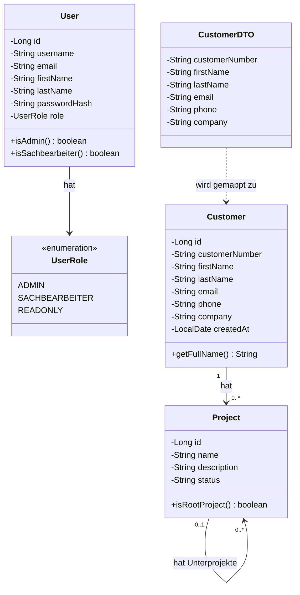
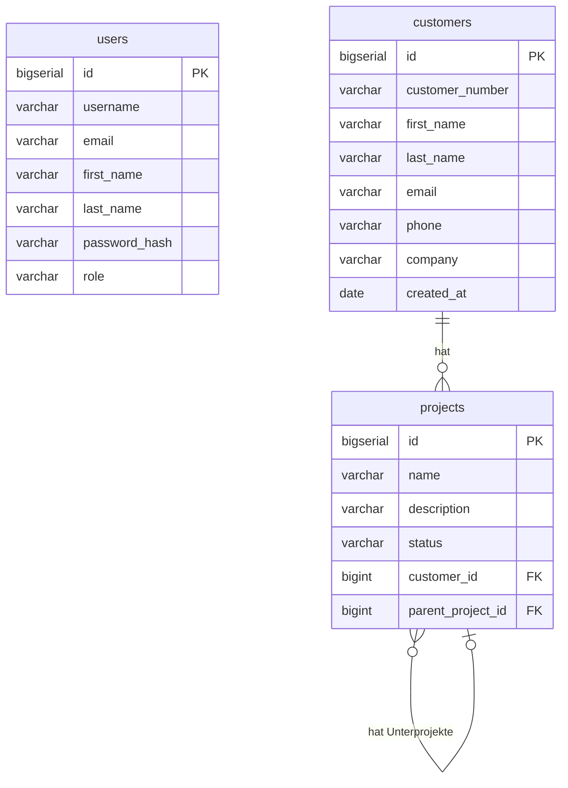
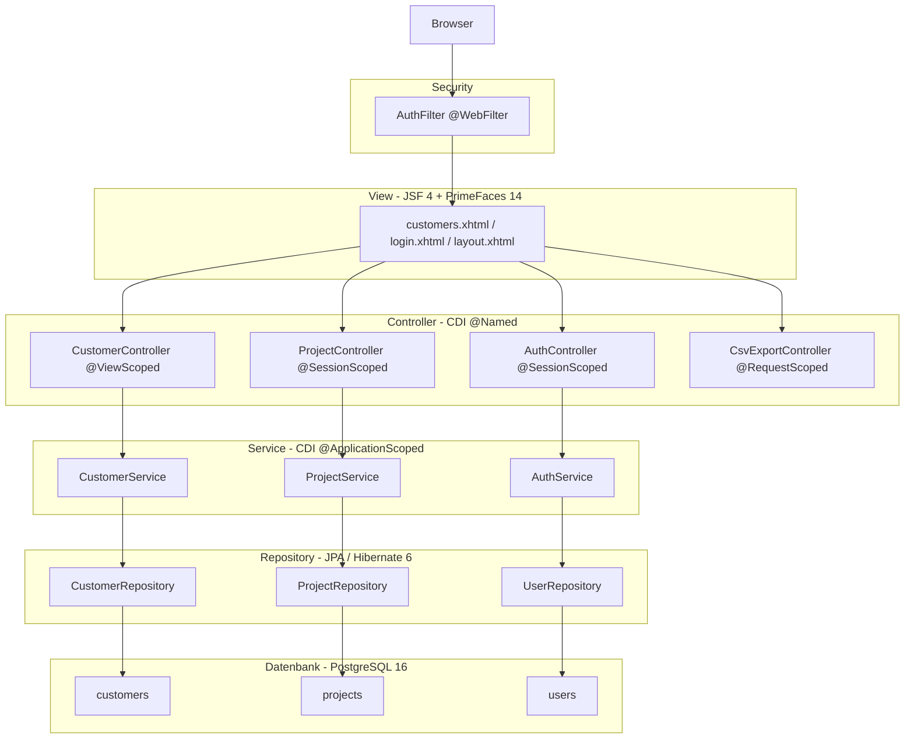

# Architektur & Datenmodell

## UML-Klassendiagramm

```mermaid
classDiagram
    class User {
        -Long id
        -String username
        -String email
        -String firstName
        -String lastName
        -String passwordHash
        -UserRole role
        +isAdmin() boolean
        +isSachbearbeiter() boolean
    }

    class UserRole {
        <<enumeration>>
        ADMIN
        SACHBEARBEITER
        READONLY
    }

    class Customer {
        -Long id
        -String customerNumber
        -String firstName
        -String lastName
        -String email
        -String phone
        -String company
        -LocalDate createdAt
        +getFullName() String
    }

    class CustomerDTO {
        -String customerNumber
        -String firstName
        -String lastName
        -String email
        -String phone
        -String company
    }

    class Project {
        -Long id
        -String name
        -String description
        -String status
        +isRootProject() boolean
    }

    User --> UserRole : hat
    Customer "1" --> "0..*" Project : hat
    Project "0..1" --> "0..*" Project : hat Unterprojekte
    CustomerDTO ..> Customer : wird gemappt zu
```

---

## ER-Diagramm (Datenbankstruktur)

```mermaid
erDiagram
    users {
        bigserial id PK
        varchar username
        varchar email
        varchar first_name
        varchar last_name
        varchar password_hash
        varchar role
    }

    customers {
        bigserial id PK
        varchar customer_number
        varchar first_name
        varchar last_name
        varchar email
        varchar phone
        varchar company
        date created_at
    }

    projects {
        bigserial id PK
        varchar name
        varchar description
        varchar status
        bigint customer_id FK
        bigint parent_project_id FK
    }

    customers ||--o{ projects : "hat"
    projects }o--o| projects : "hat Unterprojekte"
```

---

## Schichtenarchitektur

```mermaid
graph TD
    Browser[Browser]

    subgraph View[View - JSF 4 + PrimeFaces 14]
        XHTML[customers.xhtml / login.xhtml / layout.xhtml]
    end

    subgraph Filter[Security]
        AF[AuthFilter @WebFilter]
    end

    subgraph Controller[Controller - CDI @Named]
        CC[CustomerController @ViewScoped]
        PC[ProjectController @SessionScoped]
        AC[AuthController @SessionScoped]
        CSV[CsvExportController @RequestScoped]
    end

    subgraph Service[Service - CDI @ApplicationScoped]
        CS[CustomerService]
        PS[ProjectService]
        AS[AuthService]
    end

    subgraph Repository[Repository - JPA / Hibernate 6]
        CR[CustomerRepository]
        PR[ProjectRepository]
        UR[UserRepository]
    end

    subgraph DB[Datenbank - PostgreSQL 16]
        T1[customers]
        T2[projects]
        T3[users]
    end

    Browser --> AF
    AF --> XHTML
    XHTML --> CC
    XHTML --> PC
    XHTML --> AC
    XHTML --> CSV
    CC --> CS
    PC --> PS
    AC --> AS
    CS --> CR
    PS --> PR
    AS --> UR
    CR --> T1
    PR --> T2
    UR --> T3
```
